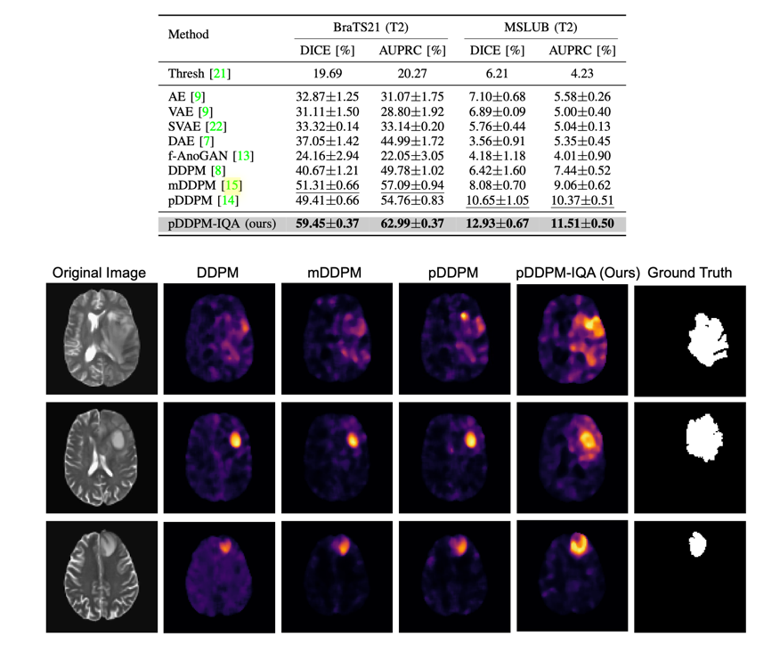

<h2><a href="https://arxiv.org/pdf/2308.05695.pdf">Investigating Medical Anomaly Detection in Brain MRI: An Image Quality Assessment Perspective</a></h2>

[Zixuan Pan](https://scholar.google.com/citations?user=3VuW2gcAAAAJ&hl=en), [Jun Xia](https://scholar.google.com/citations?user=K4JXEHUAAAAJ&hl=en&oi=ao), [Zheyu Yan](https://sites.nd.edu/zheyu-yan/), [Guoyue Xu](https://scholar.google.com/citations?hl=en&user=ntl9gCYAAAAJ), [Yawen Wu](https://sdwuyawen.github.io), [Zhenge Jia](https://zhengejia.github.io), [Jianxu Chen](https://scholar.google.com/citations?hl=en&user=HdolpOgAAAAJ), [Yiyu Shi](https://scholar.google.com/citations?hl=en&user=LrjbEkIAAAAJ&view_op=list_works)

Official PyTorch/GPU implementation of the paper
[Investigating Medical Anomaly Detection in Brain MRI: An Image Quality Assessment Perspective](https://arxiv.org/abs/2308.05695).

## Data
For our experiments, we make use of the MSLUB, BraTS21, and IXI data sets. 
You can request or download the data sets here:

* IXI: https://brain-development.org/ixi-dataset/
* BraTS21: http://braintumorsegmentation.org/
* MSLUB: https://lit.fe.uni-lj.si/en/research/resources/3D-MR-MS/

To save your time and make sure the results are reproducible, we can provide the preprocessed data and splits if you get all the licenses and agreements from the data providers and contact us via email.
Then you can directly skip to the [Environment Set-up](#environment-set-up) section to set up the environment and run the experiments.

## Data Preprocessing
We got the preprocessed data directly from the [pddpm-uad](https://github.com/FinnBehrendt/patched-Diffusion-Models-UAD) 
and conducted the extra preprocessing steps in next section.

The following preprocessing code is from the [pddpm-uad](https://github.com/FinnBehrendt/patched-Diffusion-Models-UAD)
and can not be guaranteed to get the same results as the preprocessed data we used in our experiments.

The downloaded zip files must be extracted and organized as follows before processing: 

    ├── IXI
    │   ├── t2 
    │   │   ├── IXI1.nii.gz
    │   │   ├── IXI2.nii.gz
    │   │   └── ... 
    │   └── ...
    ├── MSLUB
    │   ├── t2 
    │   │   ├── MSLUB1.nii.gz
    │   │   ├── MSLUB2.nii.gz
    │   │   └── ...
    │   ├── seg
    │   │   ├── MSLUB1_seg.nii.gz
    │   │   ├── MSLUB2_seg.nii.gz
    │   │   └── ...
    │   └── ...
    ├── Brats21
    │   ├── t2 
    │   │   ├── Brats1.nii.gz
    │   │   ├── Brats2.nii.gz
    │   │   └── ...
    │   ├── seg
    │   │   ├── Brats1_seg.nii.gz
    │   │   ├── Brats2_seg.nii.gz
    │   │   └── ...
    │   └── ...
    └── ...

We preprocess the data by resampling it to 1.0 mm, skull-stripping with HD-BET, registering it to the SRI Atlas, removing the black boarders, and correcting for N4 bias. 
You must clone and set up the [HD-BET](https://github.com/MIC-DKFZ/HD-BET) tool for skull-stripping in order to conduct the preprocessing.
The preprocessing is carried out via a separate bash script for each data set in the [preprocessing](preprocessing) directory. Go to the [preprocessing](preprocessing) directory to preprocess the data:

    cd preprocessing

execute the bash script:

    bash prepare_IXI.sh <input_dir> <output_dir>
The directory in which the downloaded, raw data is kept is referred to as the "input_dir".

Note, that the skull-stripping portion of this script will use a GPU, and you must give absolute paths.

Example for the IXI data set:

    bash prepare_IXI.sh /raw_data/IXI/ $(pwd)

The outcomes of the intermediate preprocessing stages will be organized into 4 distinct folders as a result. /processed_data/v4correctedN4_non_iso_cut contains the final scans and consequently used as inputs for mDDPM.

Place the data (the folder v4correctedN4_non_iso_cut) in your DATA_DIR after preprocessing.

    cp -r <output_dir>/IXI <DATA_DIR>/Train/ixi
    cp -r <output_dir>/MSLUB <DATA_DIR>/Test/MSLUB
    cp -r <output_dir>/Brats21 <DATA_DIR>/Test/Brats21

## Extra Preprocessing Steps
For the BraTS21 FLAIR and T1CE data, you need to extract the healthy slices by running the following command:

    python preprocess.py

And then create the splits for the BraTS21 data by running the following command:

    python create_splits.py

The directory structure of <DATA_DIR> should look like this: 

    <DATA_DIR>
      flair/
      ├── Brats21
      │   ├── FLAIR
      │   ├── Healthy
      │   ├── Healthy_mask
      │   ├── mask
      │   ├── seg
      │   └── splits
      t1ce/
      ├── Brats21
      │   ├── Healthy
      │   ├── Healthy_mask
      │   ├── mask
      │   ├── seg
      │   └── splits
      T2/
      ├── splits
      │   ├── Brats21_test.csv
      │   ├── Brats21_val.csv
      │   ├── MSLUB_test.csv
      │   ├──MSLUB_val.csv
      │   ├── IXI_train_fold0.csv
      │   ├── IXI_train_fold1.csv
      │   └── ... 
      ├── Test
      │   ├── Brats21
      │   │   ├── mask
      │   │   ├── t2
      │   │   ├── seg
      │   ├── MSLUB
      │   │   ├── mask
      │   │   ├── t2
      │   │   ├── seg
      ├── Train
      │   ├── ixi
      │   │   ├── mask
      │   │   ├── t2

You should then specify the path the location of <DATA_DIR> in the pc_environment.env file. Additionally, specify the <LOG_DIR>.

## Environment Set-up
To download the code type 

    git clone https://github.com/zx-pan/MedAnomalyDetection-IQA.git

In your linux terminal and switch directories via

    cd /MedAnomalyDetection-IQA

To setup the environment with all required packages and libraries, you need to install anaconda first. 

Then, run 

    conda env create -f environment.yml -n MAD_IQA

and subsequently run 

    conda activate MAD_IQA
    pip install -r requirements.txt

to install all required packages.

## Run Experiments

Execute the following command to begin the training and evaluation: 

    bash run.sh

To execute the experiment, you must have an NVIDIA GPU with at least 16GB of RAM. 

## Results
We provide the quantitative and qualitative results in the following table and figure:

Refer to the paper for more results and details.

## Acknowledgement

This code base is inspired and built-upon from [pddpm-uad](https://github.com/FinnBehrendt/patched-Diffusion-Models-UAD)
